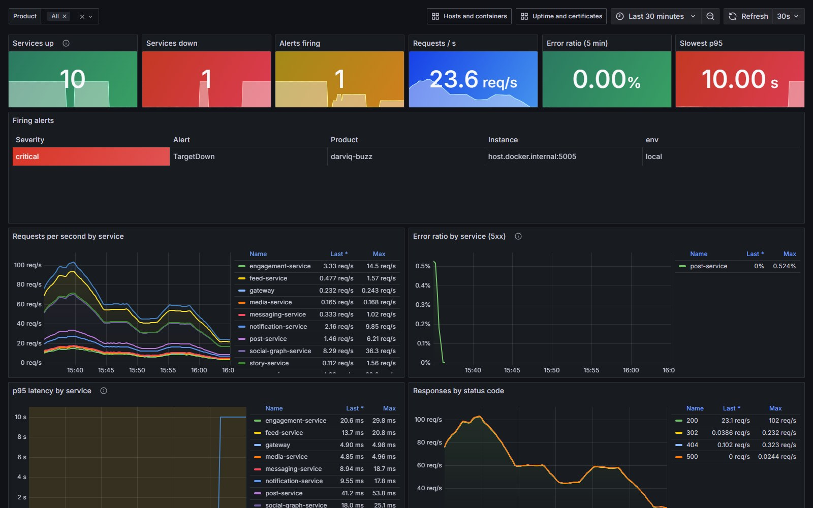
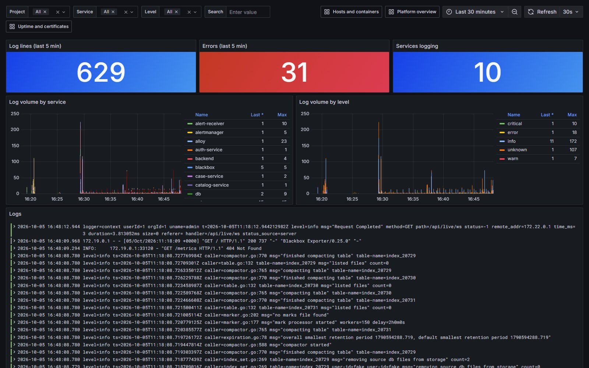
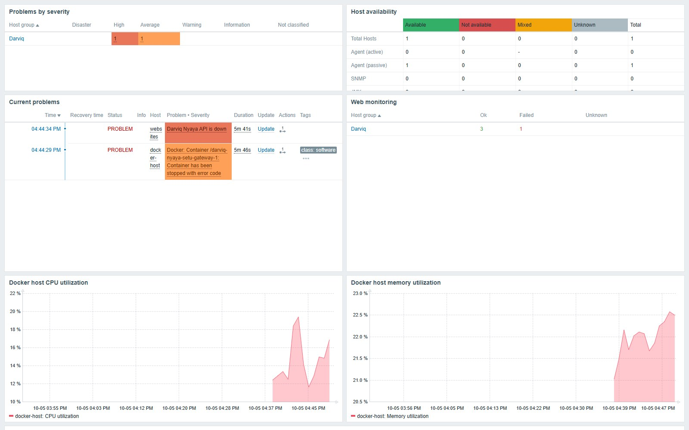
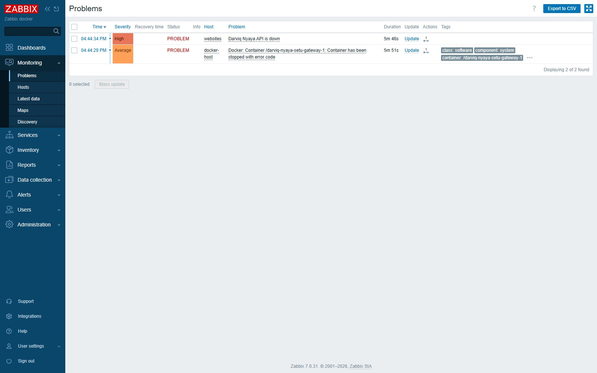
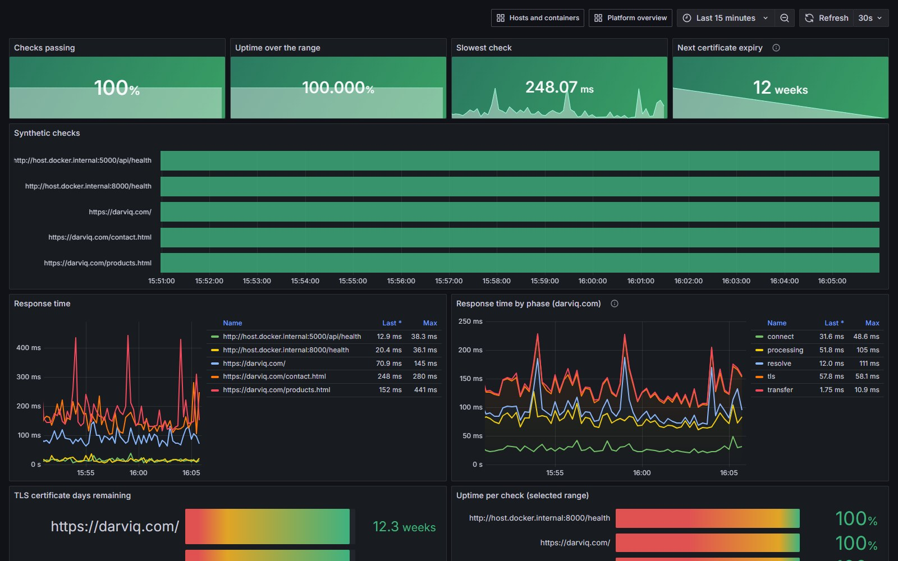
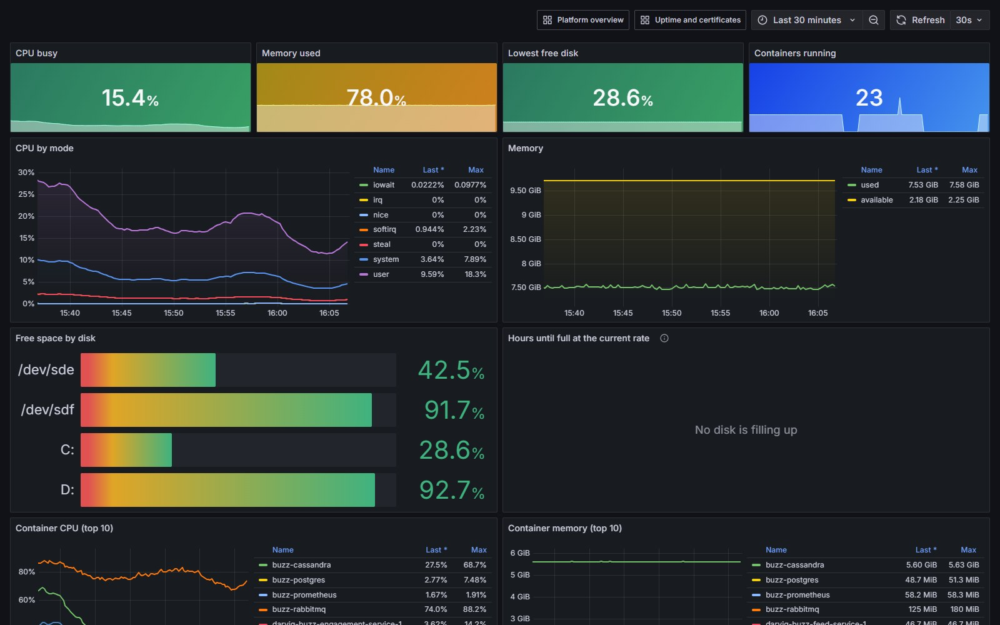
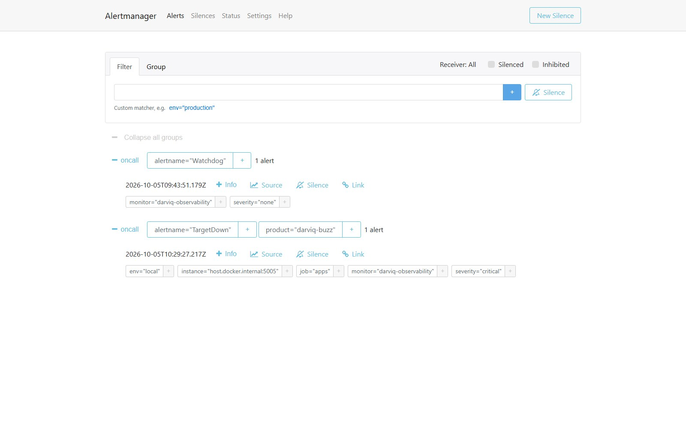
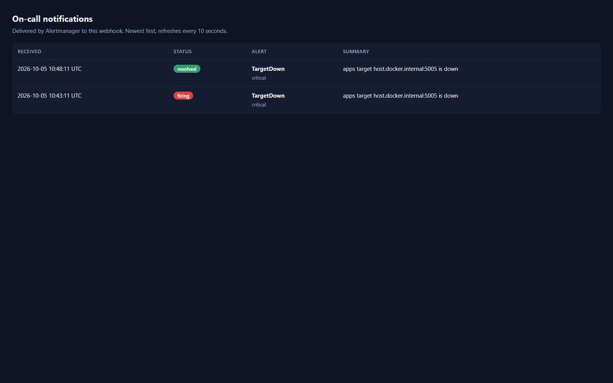
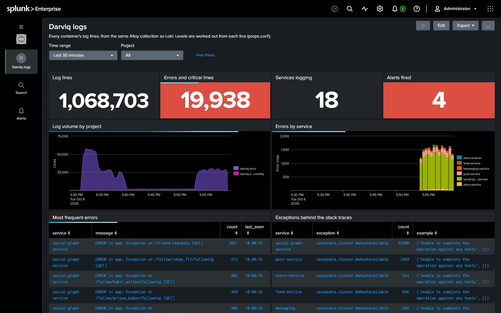
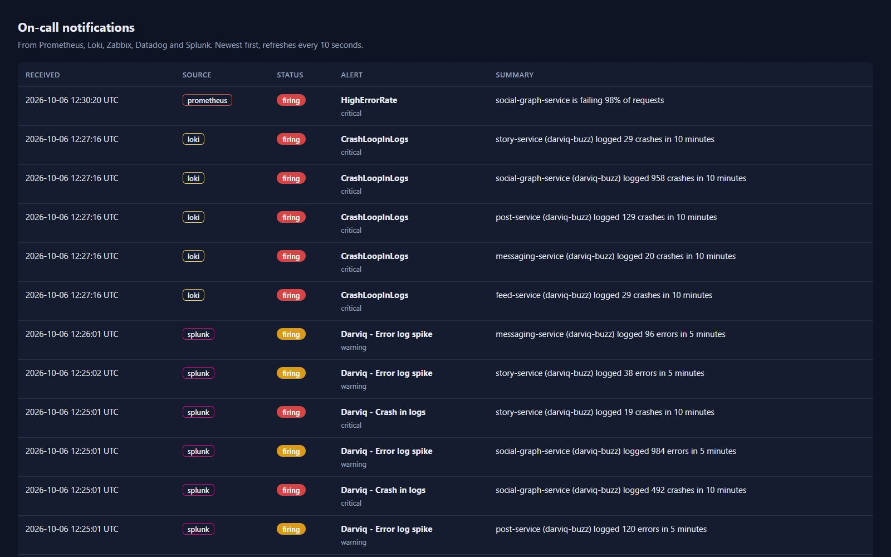

# Darviq-Observability

Automated monitoring for cloud workloads, entirely as code, across the tools teams actually use:

- **Prometheus + Grafana + Alertmanager:** metrics, dashboards generated from code, alert routing
- **Grafana Loki + Alloy:** logs from every container, searchable next to the metrics, with log-based alerts
- **Zabbix:** agent-based monitoring with its own templates, web checks and actions, configured through its API
- **Datadog:** the agent, monitors, synthetic tests and a dashboard in Terraform, ready for a Datadog account
- **Splunk Enterprise:** every container's logs through the HTTP Event Collector, with alerts and a dashboard shipped as a Splunk app

Every tool sends its alerts to **one on-call receiver**, so it doesn't matter which one noticed.
Alert rules have unit tests, every alert links to a runbook, and CI checks all of it on every change.

It watches real things: the services of [Darviq-Buzz](https://github.com/ravishekharg/Darviq-Buzz)
and Darviq-Nyaya, the Darviq-Health API, the Docker host and every container on it, and
[darviq.com](https://darviq.com) from the outside (uptime, response time, TLS certificate). Live
drills and its first hours of running caught a real bug, a latency problem, and several mistakes
of my own; see [What it found](#what-it-found).



## Tools and what each one does here

| Tool | Status | What it covers |
|---|---|---|
| **Prometheus** (`prometheus/`) | running | Scrapes every 15 s. Targets come from JSON files: adding a product means dropping a file in `targets/apps/` or `targets/probes/`, picked up within a minute. 7 recording rules, 13 alert rules, 12 unit tests. |
| **Alertmanager** (`alertmanager/`) | running | Groups by alert and product (one outage = one notification, not eleven), repeats critical alerts hourly, suppresses symptom alerts while a whole product is down. Receives Loki's log alerts too. |
| **Grafana** (`grafana/`) | running | Four dashboards (38 panels) generated by `build_dashboards.py` and provisioned read-only: Platform overview, Uptime and certificates, Hosts and containers, Logs. |
| **Blackbox exporter** | running | Outside-in HTTP checks: up or down, response time by phase (DNS, connect, TLS, server), certificate expiry. |
| **Node exporter** | running | Host CPU, memory, disk and network. |
| **Docker exporter** (`docker-exporter/`) | running | Per-container CPU, memory, network and crash restarts from the Docker Engine API, under cAdvisor's metric names. |
| **Loki + Alloy** (`loki/`, `alloy/`) | running | Alloy discovers every container and ships its logs to Loki, labelled by compose project and service; log levels are detected automatically. Two log alerts: error spikes and stack traces. |
| **Zabbix 7** (`zabbix/`) | running (profile `zabbix`) | Server, web UI, PostgreSQL and agent 2. `provision.py` sets up the Docker host with Zabbix's Linux and Docker templates (every container discovered automatically), web scenarios with "down" and "slow" triggers, a dashboard, and a webhook action to the on-call receiver. |
| **Datadog** (`datadog/`) | as code, validated; runs with your API key (profile `datadog`) | Agent with logs, containers, the same Prometheus endpoints (OpenMetrics) and HTTP checks. Terraform for 6 monitors mirroring the Prometheus alerts, synthetic tests of darviq.com from Mumbai and Ireland, a dashboard, and a webhook to the on-call receiver. |
| **Splunk Enterprise 10** (`splunk/`, `alloy/splunk.alloy`) | running (profile `splunk`) | A second Alloy collector sends every container's log lines to Splunk's HTTP Event Collector, with project, service and container as indexed fields. `splunk/app` is a Splunk app kept in the repo: the `darviq_logs` index, log levels worked out at search time (`props.conf`), two scheduled-search alerts mirroring Loki's, and a **Darviq logs** dashboard that groups repeated errors and names the exception behind each stack trace. |
| **On-call receiver** (`alert-receiver/`) | running | One page for alerts from Prometheus, Loki, Zabbix, Datadog and Splunk, recording status changes only. Slack, email or PagerDuty plug in next to it. |
| **Runbooks** (`docs/runbooks.md`) | | What each alert means, what to check first, how to fix the usual causes. |
| **CI** (`scripts/validate.sh`, `.github/workflows/`) | | Prometheus config and rules, rule unit tests, Alertmanager config, runbook links, dashboards match their generator, Loki config, Python syntax, Terraform format and validation. |

Why several tools: most organisations already run one or two of these, often side by side
(Zabbix for servers and networks, Prometheus for containers, Datadog bought by another team).
Running the same workloads through all of them shows how each one models hosts, checks and
alerts, and how to bring their alerts together in one place.

### The alerts

| Alert | Tool | Fires when | Severity |
|---|---|---|---|
| TargetDown | Prometheus | a service can't be scraped for 1 minute | critical |
| ProbeFailed | Prometheus | an outside-in HTTP check fails for 2 minutes | critical |
| SlowResponse | Prometheus | a checked page averages over 2 s for 5 minutes *while it is up* | warning |
| TLSCertificateExpiringSoon | Prometheus | a certificate expires within 14 days | warning |
| HighErrorRate | Prometheus | over 5% of a service's requests are 5xx for 5 minutes, *with real traffic* | critical |
| HighLatencyP95 | Prometheus | p95 over 500 ms for 10 minutes, with real traffic | warning |
| DiskSpaceLow / DiskSpaceCritical | Prometheus | under 15% / 5% free | warning / critical |
| DiskWillFillIn24h | Prometheus | at the last 6 hours' rate the disk is full within a day, while it still has space | warning |
| HighCPU, MemoryPressure | Prometheus | over 90% for 15 / 10 minutes | warning |
| ContainerRestarting | Prometheus | Docker restarted a container after a crash (not a deliberate redeploy) | warning |
| Watchdog | Prometheus | always; if it stops arriving, the alert pipeline is broken | none |
| ErrorLogSpike | Loki | a service logs over 20 error lines in 5 minutes | warning |
| CrashLoopInLogs | Loki | a service logs several stack traces in 10 minutes | critical |
| *site* is down / is slow | Zabbix | a web scenario fails / averages over 2 s while up | high / warning |
| Docker container stopped with error code, and the rest of Zabbix's templates | Zabbix | per container and host, from the official templates | per template |
| Darviq - Error log spike / Crash in logs | Splunk | the same conditions as ErrorLogSpike and CrashLoopInLogs, as scheduled searches every minute; one notification per service, then quiet for 30 minutes | warning / critical |
| Datadog monitors | Datadog | mirrors of TargetDown/ProbeFailed, HighErrorRate, SlowResponse, DiskWillFillIn24h, ContainerRestarting, ErrorLogSpike | |

## Running it

```bash
docker compose up -d                    # Prometheus, Alertmanager, Grafana, Loki, Alloy, exporters
bash scripts/zabbix-up.sh               # adds Zabbix and configures it through its API
DD_API_KEY=... docker compose --profile datadog up -d     # adds the Datadog agent
docker compose --profile splunk up -d   # adds Splunk and its log collector (about 4 GB of memory)

#   Grafana       http://localhost:3000   (admin / GRAFANA_ADMIN_PASSWORD, default change-me-locally)
#   Zabbix        http://localhost:8081   (Admin / zabbix: Zabbix's default, change it beyond a laptop)
#   Prometheus    http://localhost:9091      Alertmanager  http://localhost:9094
#   Loki          http://localhost:3100      On-call page  http://localhost:9099
#   Splunk        http://localhost:8002   (admin / SPLUNK_PASSWORD, default change-me-locally)

bash scripts/validate.sh                # everything CI checks, in containers
python grafana/build_dashboards.py      # after editing a dashboard
curl -X POST localhost:9091/-/reload    # after editing Prometheus rules or targets
```

Datadog's monitors, synthetics and dashboard: `cd datadog/terraform && terraform init && terraform apply`
with `TF_VAR_datadog_api_key` and `TF_VAR_datadog_app_key` set. Datadog's free plan covers host
and container metrics; log management and synthetic tests are paid features.

Splunk starts on its 60-day Enterprise trial licence, which includes alerting. After that it falls
back to Splunk Free (500 MB of logs a day, no alerts and no login), so the alerts here need a
trial, a developer licence or a paid one beyond two months. Splunk's alerts are events, not
states: they say "this happened" and send no "resolved" notice, so on the on-call page they show
as firing only.

`node demo/seed-buzz.mjs` creates invented sample accounts and posts in a fresh Buzz, then
`node demo/traffic.mjs 15` sends 15 minutes of realistic browsing traffic to Darviq-Buzz so the
dashboards have something to show on a laptop: real requests through the real stack, nothing
written into the metrics directly.

## Proven live: incident drills

**One service down (Prometheus).** With demo traffic running, Buzz's `story-service` was stopped.
**TargetDown** fired 90 seconds later (1 minute `for:` plus scrape and evaluation interval), the
on-call receiver had it a second after that, and the home page's p95 rose from about 0.5 s to
10 s while the front end waited for the missing service. After the restart the **resolved**
notice arrived within 2 minutes (Alertmanager batches group updates into 5-minute windows).

**One gateway down, seen by two tools.** Nyaya's API gateway was stopped. Zabbix noticed first:
the Docker template reported the container stopping (exit code 137) after about 37 seconds and
its web scenario failed seconds later. Prometheus followed with TargetDown at 80 seconds and
ProbeFailed at 2 minutes, and Loki had the web server's "connect() failed" lines in red. All of
it arrived on the one on-call page, and every alert resolved there when the gateway came back.

**The database down, seen by three tools.** With demo traffic running, Buzz's Cassandra was
stopped. Splunk paged first, after **24 seconds**: its searches run every minute and fire on the
first match, flagging error spikes and stack traces in five services at once. Loki's
CrashLoopInLogs followed at 2 min 39 s and Prometheus's HighErrorRate (98% of social-graph
requests failing) at 5 min 40 s, by design: it waits for 5 minutes of sustained errors. Splunk's
dashboard named the cause, `cassandra.cluster.NoHostAvailable` behind every stack trace. When
Cassandra came back the services reconnected by themselves within a few minutes.

## What it found

Monitoring is only worth it if it tells you things you didn't know:

1. **A real bug in Darviq-Buzz.** The *Error ratio by service* panel showed post-service failing
   about 1% of requests: mistyped post URLs made a timestamp parser crash, so a typo became a
   **500** instead of a **404**. Fixed in Darviq-Buzz.
2. **A latency problem, still open.** Buzz's home page p95 is 0.5–0.7 s on a laptop, over the
   500 ms objective, because it calls several services one after another.
3. **A flaw in Darviq-Buzz's own alerts.** Its "stalled consumer" rules fire whenever the site is
   quiet. They should only fire when messages are waiting and nothing consumes them.
4. **Mistakes of my own, caught by the drills.** A health check pointed at the wrong path (when an
   alert fires from minute one, suspect the check). `ContainerRestarting` paged on every
   deliberate redeploy; it now uses Docker's crash-restart count. The receiver logged every
   re-sent alert; it now records changes only. And in both Prometheus and Zabbix, a "slow" alert
   fired on top of "down" for the same outage, because a failing check is slow too (a proxy
   waiting 3 s for a dead upstream); both now count only checks that succeeded, with a test. And
   the log alert for stack traces fired on itself: Loki logs each rule evaluation including the
   query text, which contains the very words the rule searches for. Loki's own logs are now
   excluded from log alerts.
6. **Alerts feeding alerts, found while adding Splunk.** The on-call receiver logs every
   notification with its severity, so a burst of critical alerts read as a burst of critical log
   lines and raised an error-spike alert about the receiver itself. Loki's rules had the same
   loop; both tools now leave the receiver (and Loki and Splunk, which log their own search text)
   out of log alerts. Splunk's very first alert was also false: Alloy logs failed retries as
   `level=info ... error="connection refused"`, and matching the word "error" made it an error.
   A level the line states itself now wins over keywords, as it does in Loki.
7. **Logs can be lost when the destination is down.** While Splunk restarted, Alloy's Splunk
   sender retried, filled its queue and dropped lines ("sending queue is full"); Loki kept its
   copy. A disk-backed queue in the collector, or Splunk's own forwarder, closes that gap.
5. **Tool gotchas worth knowing.** cAdvisor can't see containers on Docker Desktop's containerd
   image store, so a small Docker API exporter replaces it. A brand-new Zabbix database without
   planner statistics ran the template-linking query for minutes at 100% CPU; `ANALYZE` (2 s)
   fixed it, and `scripts/zabbix-up.sh` now runs it.

## Taking it to the cloud

The same configuration runs unchanged on a VM next to the workloads. For Kubernetes, the rules,
tests, dashboards and runbooks carry over; Prometheus Operator (`PrometheusRule`, `ServiceMonitor`)
replaces the file-based targets, the Loki and Datadog Helm charts replace the compose services,
and Zabbix's Kubernetes templates replace the Docker one. Managed options keep the same rules:
Amazon Managed Service for Prometheus with Amazon Managed Grafana, Grafana Cloud, or Datadog.
For Splunk Cloud, point the collector at the cloud HEC endpoint with a token and install
`splunk/app` there; Splunk's own OpenTelemetry Collector for Kubernetes is the Helm-chart
equivalent of `splunk.alloy`.

## Screenshots

| | |
|---|---|
|  |  |
|  |  |
|  |  |
|  |  |
|  |  |

## Licence

Copyright (c) 2026 Darviq Systems. All rights reserved. Published for viewing and evaluation; see
[LICENSE](LICENSE). For licensing or a custom build, contact hello@darviq.com.
